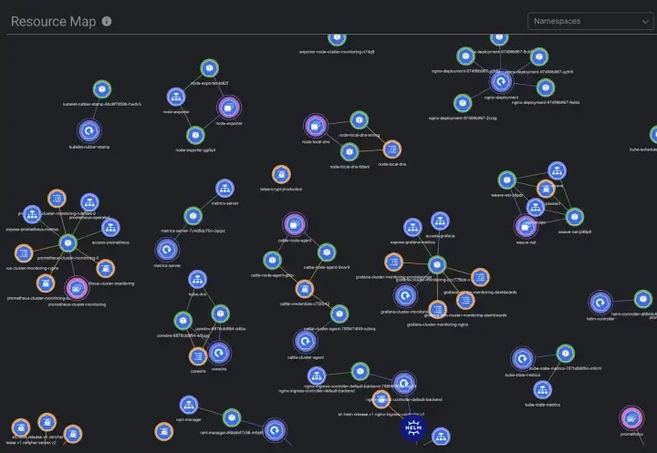

# Lens — IDE for Kubernetes

## Table of contents

1. Introduction
2. Installing and running
3. Features
   * Terminal
   * Windows
   * Logs
   * Port Forwarding
   * Extensions
4. Conclusion
5. References

## Introduction

What ways do you know to interact with kubernetes clusters?
First and most available is the command line. But when the project grows to large sizes and amounts to dozens of microservices it is quite difficult to manage it via console.
The second option is kubernetes dashboard. It is a web-based user interface for Kubernetes. The Dashboard UI is not deployed by default but it is easy to install it by applying the appropriate configuration from the official kubernetes repository. Read more [here](https://kubernetes.io/docs/tasks/access-application-cluster/web-ui-dashboard/).

I used to work with kubernetes web-based UI for a few months until my colleagues advised me to try [Lens](https://k8slens.dev/index.html).
Lens — is advanced Kubernetes platform. It provides plenty of useful features and tools to make your work with kubernetes clusters more comfortable and productive.

I will try to show benefits of using Lens instead of web-based UI on real examples based on my personal user experience.

## Installing and running

Firstly you need to [download](https://github.com/lensapp/lens/releases) and install the required package of Lens for your distribution.
Then you need to import your kuberconfig file of the cluster to Lens.
You can store many kuberconfigs in Lens (they are displayed in Catalog -> Clusters) and switch between them using the sidebar.

As soon as you connected to the cluster you see the main window with tools and panels for interaction.
The first thing you may notice is dark colors. All lovers of dark theme are invited!

There is a left sidebar with all cluster elements and the window on the right side with information about these elements.
You could see all the same on the web-based kubernetes dashboard but in a different way.
Let’s talk about differences and features…

## Features

### Terminal

One of the powerful features is the embedded terminal. You are already logged in the kubernetes cluster and can interact with it through the terminal right in the Lens.

### Windows

The interface of Lens is built on the windows. Unlike the web-based UI where you need to open a few tabs in the browser to manage resources simultaneously, in Lens you work with windows and switch between them within the one page.

### Logs

Most of the time the developer works with logs in Kubernetes. It is very important to do the work with logs comfortably.

Remember the logs in kubernetes dashboard:
The page with logs has arrows pagination. It is so inconvenient to seek the right place switching the pages with logs. In most cases you just download the logs and work with them in another text editor.
Furthermore to get new logs you need to refresh the page manually or turn on the auto-refreshing but it only works every 5 seconds.

Lens in return provides logs that are updating constantly as they come. It has scroll pagination, that is much more comfortable. Also you can use the search bar to find the information among all previous and current logs.

### Port Forwarding

In my work I often use port forwarding to get access to resources from my local machine.
Usually you do it by using kubectl. You need to find a pod name, open the terminal and type the command. After rebooting the system you need to do the same actions to forward ports.
By using Lens you can simply do it by clicking the button in the pod description.

All earlier forwarder ports are displayed in the Port Forwarding section. Once again you connect to the cluster, Lens will try to forward ports that you forwarded earlier. Also you can simply turn on and off connections on this page.

### Extensions

Since version 4.0 Lens supports the system of extensions with which it is possible to add custom elements. There are two types of extensions: vendor (supported by Lens) and community (supported by users). You can read more [here](https://github.com/lensapp/lens-extensions).

For example [Kubescape](https://github.com/kubescape/lens-extension) extension will help you to easily scan and detect misconfigurations, software vulnerabilities, and RBAC (role-based-access-control) violations in your K8S cluster.

[Lens resource map](https://github.com/nevalla/lens-resource-map-extension) extension displays your cluster resources as a connected graph that changes in a real time.

## Conclusion

Lens provides not only a convenient UI with useful tools and features for users but the whole platform to realize productive interaction with Kubernetes clusters.
The system of extensions allows users to modify and customize the system to fit their goals.
As an active user of Lens I recommend you at least to try it if you are working with Kubernetes clusters. It definitely can save your time and make your work more comfortable.

## References

- https://kubernetes.io/docs/tasks/access-application-cluster/web-ui-dashboard/
- https://k8slens.dev/index.html
- https://github.com/lensapp/lens/releases
- https://github.com/lensapp/lens-extensions
- https://github.com/kubescape/lens-extension
- https://github.com/nevalla/lens-resource-map-extension

*Made by **Vladislav Korolev***

