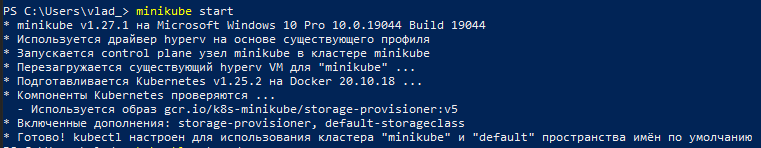
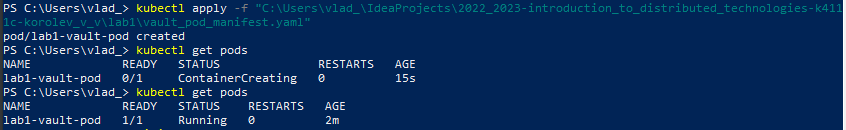
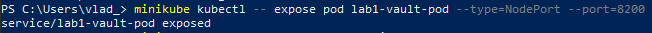
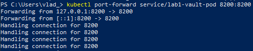
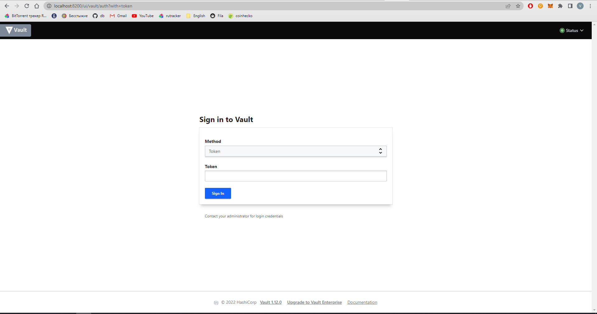
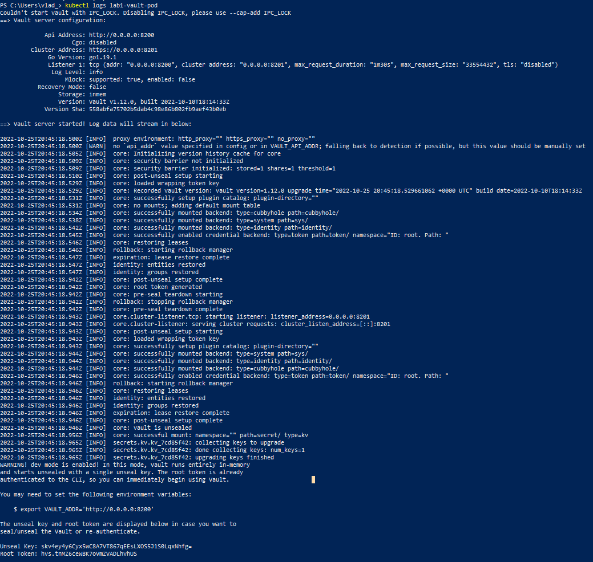
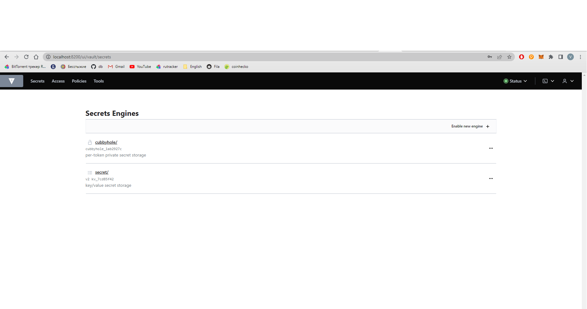

**Lab1: Install Docker and minikube. My first manifest.**

After installing a minikube it was started by *minikube start*, so the cluster was raised.

Then a manifest file *vault_pod_manifest.yaml* was created with following content to describe new pod *lab1-vault-pod*.
```aidl
apiVersion: v1
kind: Pod
metadata:
  name: lab1-vault-pod
  labels:
    app: lab1-vault
spec:
  containers:
    - name: lab1-vault-container
      image: vault
      resources:
        limits:
          memory: "1Gi"
        requests:
          memory: "500Mi"
```
Created earlier manifest file was applied and pod was created successfully.


Then the service for *lab1-vault-pod* was created. It serves 8200 port.


And also local port 8200 was forwarded to a pod same port 8200.


Now we can access the vault by *localhost:8200* address.


To get the access token we should check vault logs. There is a *root token* string with needed value.


Using this token it was logged in vault.



