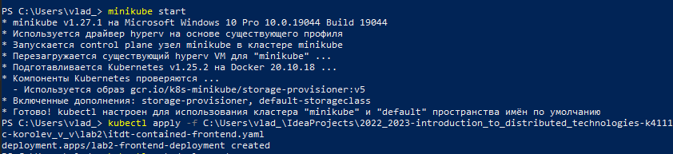
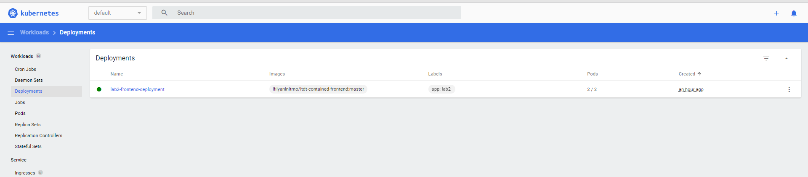
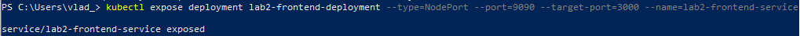
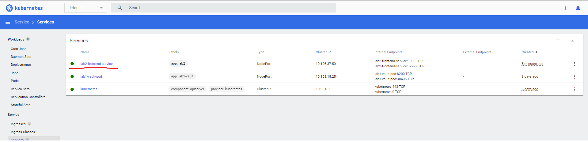
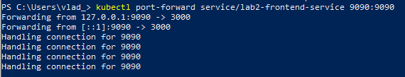
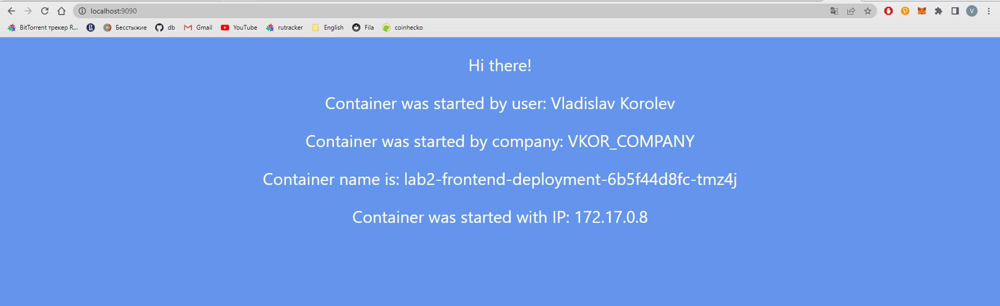
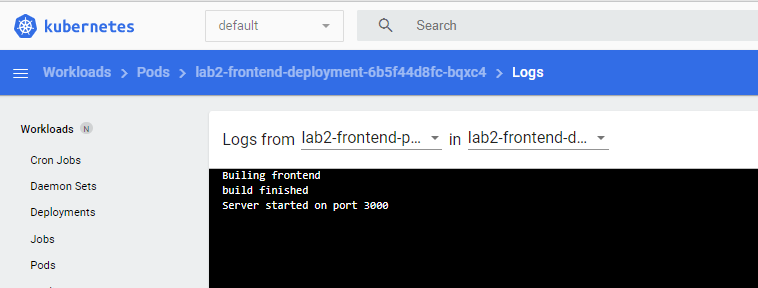
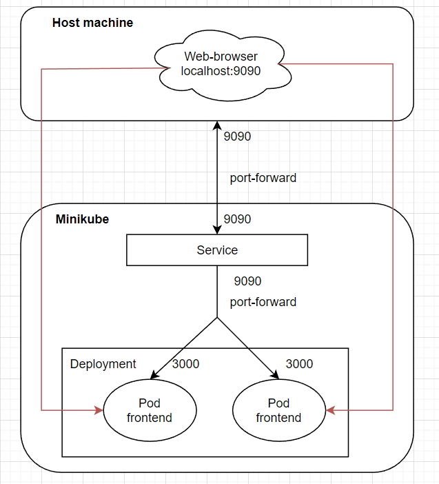

University: [ITMO University](https://itmo.ru/ru/)

Faculty: [FICT](https://fict.itmo.ru)

Course: [Introduction to distributed technologies](https://github.com/itmo-ict-faculty/introduction-to-distributed-technologies)

Year: 2022/2023

Group: K4111с

Author: Korolev Vladislav Vadimovich

Lab: Lab2

Date of create: 20.09.2022

Date of finished: 17.11.2022

### Lab2: Deployment of web service in minikube. Access to web interface of service. Monitoring of service.

Minikube was started and manifest of new deployment was applied.


The content of manifest:
```aidl
apiVersion: apps/v1
kind: Deployment
metadata:
  name: lab2-frontend-deployment
  labels:
    app: lab2
spec:
  replicas: 2
  selector:
    matchLabels:
      app: lab2
  template:
    metadata:
      labels:
        app: lab2
    spec:
      containers:
        - name: lab2-frontend-pod
          image: ifilyaninitmo/itdt-contained-frontend:master
          env:
            - name: REACT_APP_USERNAME
              value: "Vladislav Korolev"
            - name: REACT_APP_COMPANY_NAME
              value: "VKOR_COMPANY"
          ports:
            - containerPort: 3000
```
There are 2 replicas of container *ifilyaninitmo/itdt-contained-frontend:master*. Two env variables were specified - **REACT_APP_USERNAME** and **REACT_APP_NAME** with appropriate values. Also, container port was specified as 3000 because the application is running on this port in container.

The availability of service was checked in minikube dashboard.


Using *kubectl expose* the new service was created for that deployment. The service port is 9090 and the target port of pod is 3000. Also type is **NodePort**, that exposes the service on each Node's IP at a static port.


The service was appeared in dashboard. It is active.


Then local port 9090 was forwarded to a service same port 9090 to get access from local host.


The application was opened in browser by *localhost:9090*. The values of transferred env variables are displayed on the page. 


The logs of container were checked in dashboard.


The schema:

