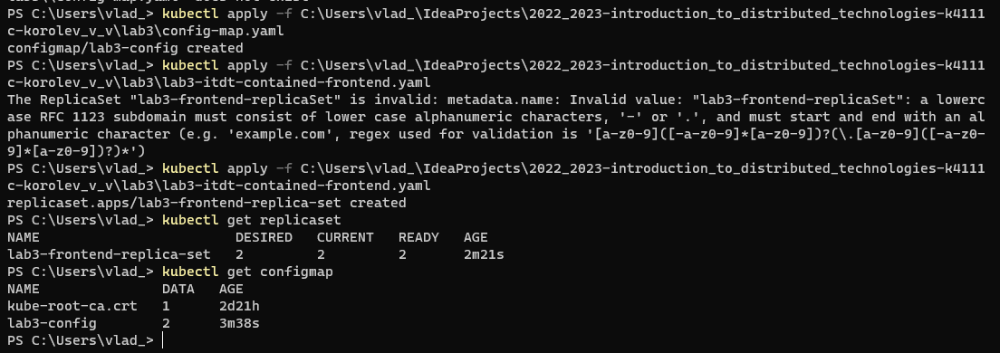
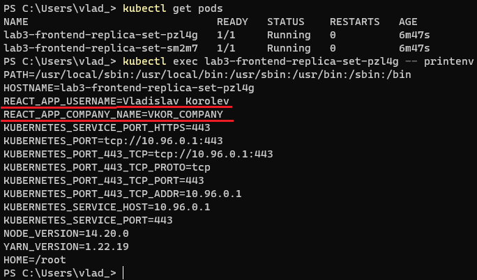
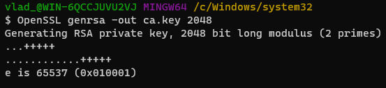
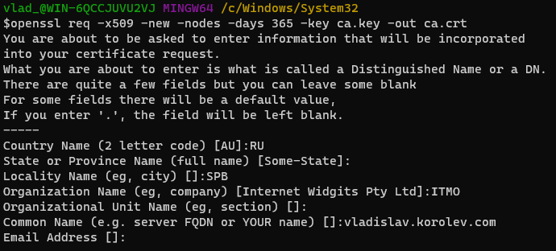
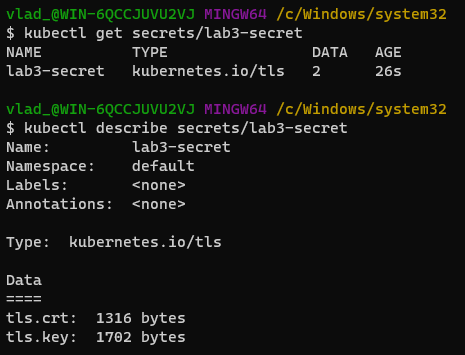
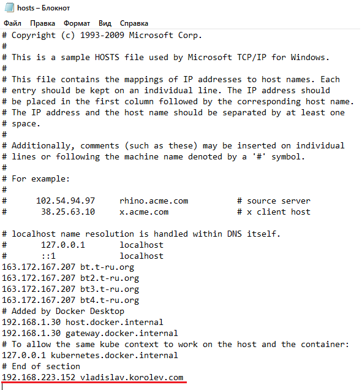
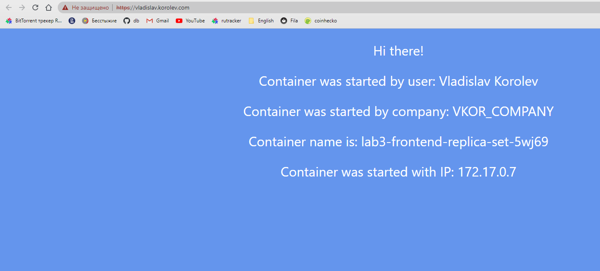
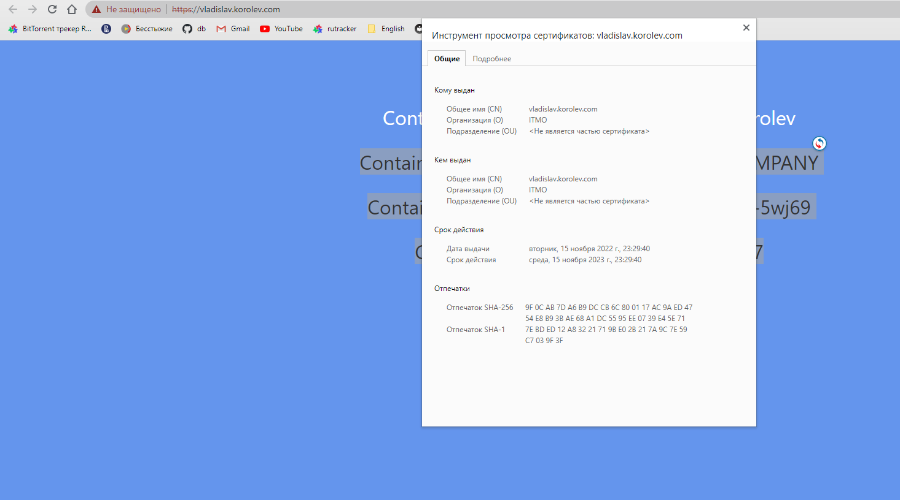
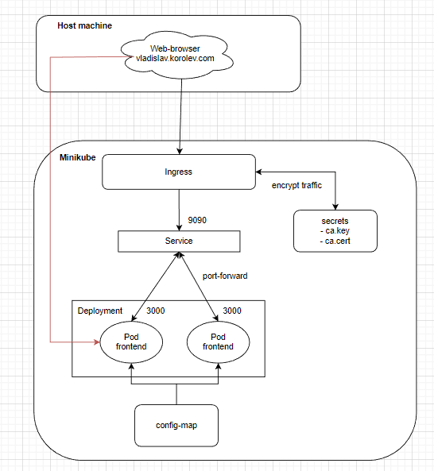

University: [ITMO University](https://itmo.ru/ru/)

Faculty: [FICT](https://fict.itmo.ru)

Course: [Introduction to distributed technologies](https://github.com/itmo-ict-faculty/introduction-to-distributed-technologies)

Year: 2022/2023

Group: K4111с

Author: Korolev Vladislav Vadimovich

Lab: Lab3

Date of create: 13.11.2022

Date of finished: 17.11.2022

### Lab3: Certificates and secrets in minikube. Secure data storage.

The manifest for new config-map was written with 2 key-value pairs - **reactapp.username** and **reactapp.companyName**.
```aidl
apiVersion: v1
kind: ConfigMap
metadata:
  name: lab3-config
  namespace: default
data:
  reactapp.username: Vladislav Korolev
  reactapp.companyName: VKOR_COMPANY
```

Then manifest for replica-set with 2 pods of *ifilyaninitmo/itdt-contained-frontend:master* was created. Also 2 env variables are specified from config map, that was designed earlier. 
```aidl
apiVersion: apps/v1
kind: ReplicaSet
metadata:
  name: lab3-frontend-replica-set
  labels:
    app: lab3
spec:
  replicas: 2
  selector:
    matchLabels:
      app: lab3
  template:
    metadata:
      labels:
        app: lab3
    spec:
      containers:
        - name: lab3-frontend-pod
          image: ifilyaninitmo/itdt-contained-frontend:master
          env:
            - name: REACT_APP_USERNAME
              valueFrom:
                configMapKeyRef:
                  name: lab3-config
                  key: reactapp.username
            - name: REACT_APP_COMPANY_NAME
              valueFrom:
                configMapKeyRef:
                  name: lab3-config
                  key: reactapp.companyName
          ports:
            - containerPort: 3000
```

Then these manifest was applied and checked in minikube.


Using *kubectl exec* it was connected to pod and shown its env variables. So we can see that variables from config map was added correctly.


Using *OpenSSL* the new rsa key was created.


Then the new certificate based on rsa key was created. The FQDN for common name is **vladislav.korolev.com**.


Then the new secret with key and certificate was created (lab3-secret).
```aidl
kubectl create secret tls lab3-secret \
--key ca.key \
--cert ca.cert
```

The secret was checked in minikube:


The new service for replicaset was created (lab3-service). It listens 9090 port and forwards to 3000.
```aidl
apiVersion: v1
kind: Service
metadata:
  name: lab3-service
spec:
  selector:
    app: lab3
  ports:
    - protocol: TCP
      port: 9090
      targetPort: 3000
  type: NodePort
```

Then the addon **ingress** for minikube was enabled:
```aidl
minikube addons enable ingress
```

And new ingress was created. It serves the lab3-service, uses tls key and cert specified in lab3-secret and forwards to 9090 port of service.
```aidl
apiVersion: networking.k8s.io/v1
kind: Ingress
metadata:
  name: lab3-ingress
  annotations:
    nginx.ingress.kubernetes.io/rewrite-target: /
spec:
  tls:
    - secretName: lab3-secret
      hosts:
        - vladislav.korolev.com
  rules:
    - host: vladislav.korolev.com
      http:
        paths:
          - pathType: Prefix
            path: /
            backend:
              service:
                name: lab3-service
                port:
                  number: 9090
```

Then the DNS was configured in file hosts on local host - the new record was added with ip-address of ingress and FQDN, that specified in tls certificate.


As a result the web page was opened in browser by FQDN name, that was configured - **vladislav.korolev.com**.


The created and configured TLS certificate is also active.


The schema:

