University: [ITMO University](https://itmo.ru/ru/)

Faculty: [FICT](https://fict.itmo.ru)

Course: [Introduction to distributed technologies](https://github.com/itmo-ict-faculty/introduction-to-distributed-technologies)

Year: 2022/2023

Group: K4111с

Author: Korolev Vladislav Vadimovich

Lab: Lab4

Date of create: 16.11.2022

Date of finished: 17.11.2022

### Lab4: Communication networks in minikube. CNI and CoreDNS.

The minikube was started on two nodes with CNI calico and kubernetes version 1.24.3.

*P.S. Also the memory for each node was specified as 1900 mb except the default 2200 mb, because there is lack of RAM on my local machine.*
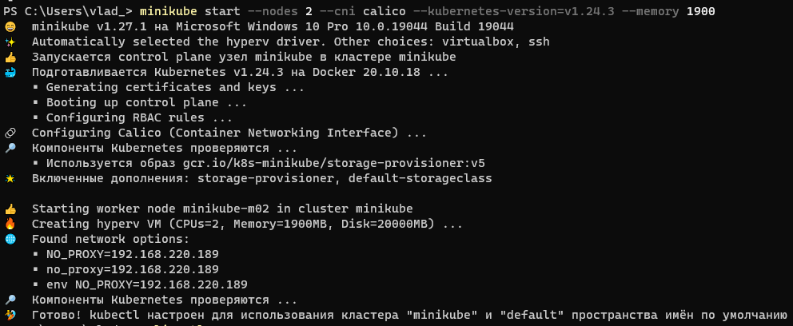

Then the **calicoctl** was deployed in minikube (manifest file is taken from official calico repository).
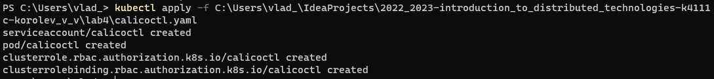

Then the ip pools was displayed using calicoctl. As we can see there is one default ipv4 pool.
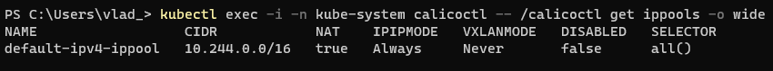

The default pool was deleted. Also, 2 labels - **zone=south** and **zone=north** was specified for nodes.
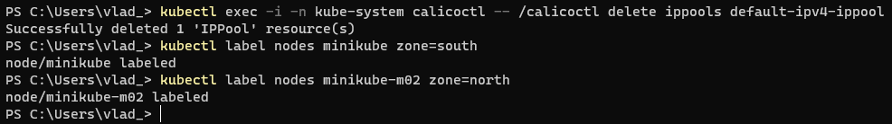

Then the new manifest for IPPool was created. For zone = south CIDR is **10.0.0.0/8**, for zone = north CIDR is **172.16.0.0/26**.
```aidl
apiVersion: projectcalico.org/v3
kind: IPPool
metadata:
  name: south-ippool
spec:
  cidr: 10.0.0.0/8
  ipipMode: Always
  natOutgoing: true
  nodeSelector: zone == "south"
---
apiVersion: projectcalico.org/v3
kind: IPPool
metadata:
  name: north-ippool
spec:
  cidr: 172.16.0.0/26
  ipipMode: Always
  natOutgoing: true
  nodeSelector: zone == "north"
```

The manifest was applied.
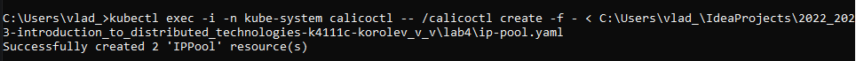

And as we can see two ip pools was added successfully.
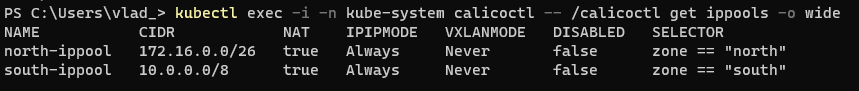

After that similarly to previous lab the replica-set with two replicas, config map with env vars for pods and service for replica-set were created. 
As we can see the ips for pods are allocated from two different subnets, that were specified in ip pools.
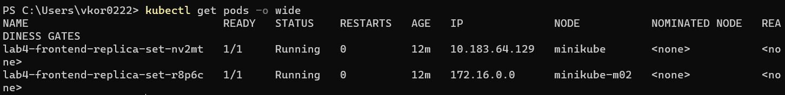

Using 
```aidl
minikube service lab3-service
```
the port was forwarded for service (it is possible only if the service has type: LoadBalancer) and the page was opened in browser.
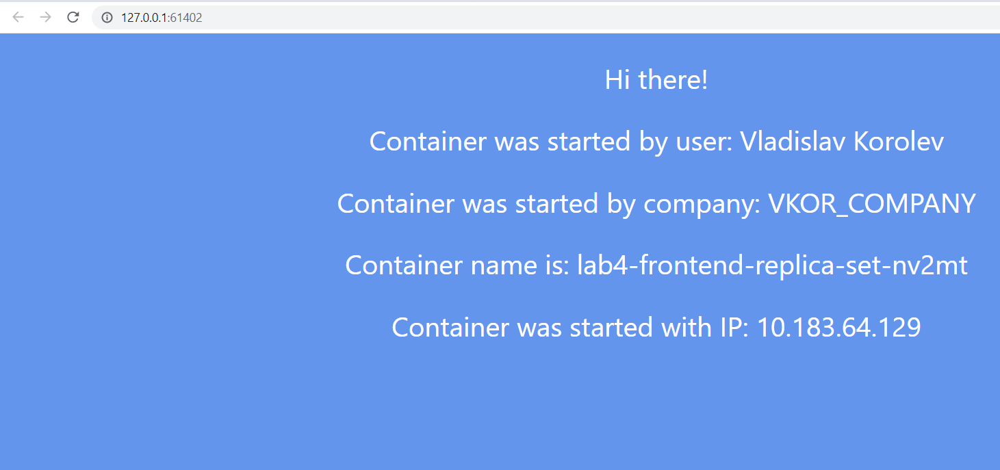
As we can see the pod with ip from "south" zone returned the answer.

Refreshing the page we can produce a result when container name and ip will be changed for "north" zone.
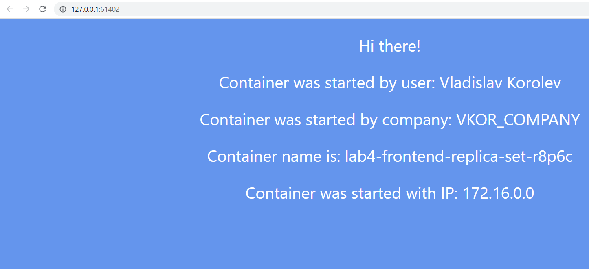

Also, the availability between pods was checked by pinging each other.
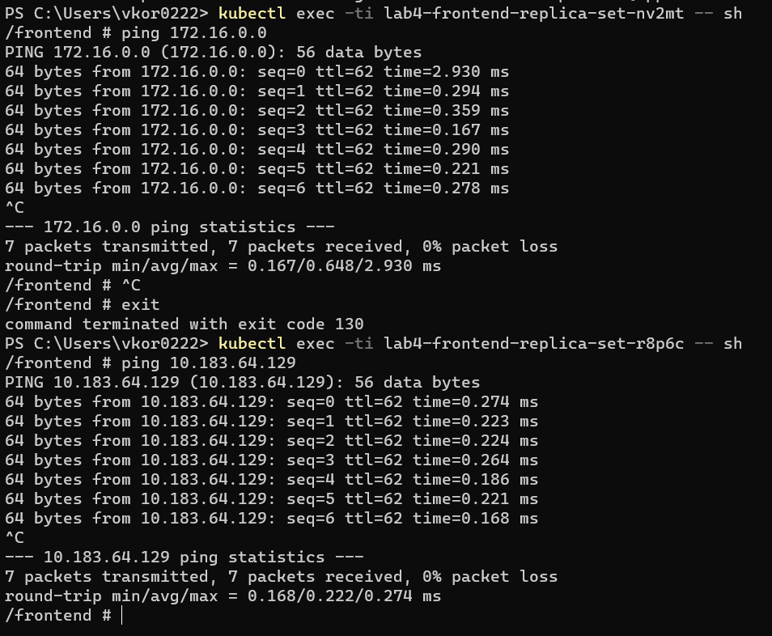

The schema:
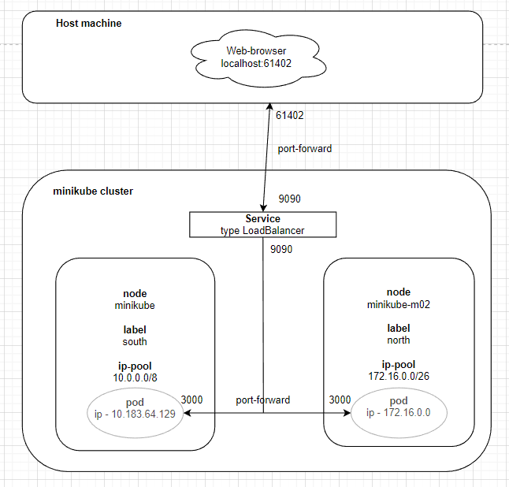

